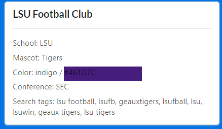

### Bootcamp 4 - Introduction to Front-end Development with React

In this assignment, we will continue to build upon our directory application by creating a front-end interface with React.js to display the football clubs, as well as the ability to add new football club, search, edit, and delete old ones. 

This readme file contains a very detailed overview of the technologies and concepts we will be using for this project. I highly suggest reading through it thoroughly and as you start working on the project visiting many of the linked items to understand the concepts and technologies in more depth.

### FRONT-END DEVELOPMENT
Front-end web development revolves around anything you create that the users of that specific app sees. To put it plainly, it is everything to do with the User Interface (UI) of the app.

When developing the UI of your web application you will be using three major languages:
- [**HTML**](https://www.w3schools.com/html/) (HyperText Markup Language) is a [**markup language**](https://en.wikipedia.org/wiki/Markup_language) most commonly used to create web pages. HTML is used to build the structure of your web page.
- [**CSS**](https://www.w3schools.com/css/default.asp) (Cascading Style Sheets) is used to describe the presentation of our HTML pages. It is a styling markup language is used to format the appearance of different structural elements. 
- [**JavaScript:**](https://www.w3schools.com/js/default.asp) A programming language is used to describe the functionality and handle all the dynamic elements on the web page. 
- [**JSX**](https://reactjs.org/docs/introducing-jsx.html) - JSX is a syntax extension to JavaScript used by React. JSX mixes HTML and JavaScript. It is similar to a template language, but it has full power of JavaScript.

If you aren't familiar with these technologies, please go through [this tutorial](http://learn.shayhowe.com) to learn the fundamentals of these two web technologies before continuing to the ***Bootstrap 4*** section. Keep in mind that this tutorial is very detailed and may take some time. Make sure to pay specific attention to:

- The semantic nature of HTML
- Layering CSS styles in a modular fashion using multiple classes
- The box model
- Positioning content with CSS

To get a basic introduction to JSX [**see the docs here**](https://reactjs.org/docs/introducing-jsx.html) and find a more in-depth tutorial on JSX [**here**](https://reactjs.org/docs/jsx-in-depth.html). In most cases, we will use JSX instead of Javascript to develop our application. 

### Single-page Application
In this course and project we will be building, a single-page application. A single-page applictation is an application that loads a single HTML page and all the necessary assets (such as JavaScript and CSS) required for the application to run. Any interactions with the page or subsequent pages do not require a round trip to the server which means the page is not reloaded. Most modern web development relies on single-page applications. 

### Model-View-Controller (MVC) Architecture

A common design pattern used for developing user interfaces is the **model-view-controller** architecture. As the name suggests, in this architecture the application is broken up into three main components:

- The **model** is where the application's main data objects are stored.
- The **view** presents models to the user, and allows the user to interact with the models
- The **controller** interfaces between the model and the view
    - it updates models according to input provided by the user in the view
    - it updates the view when a model changes

The MVC concept has many variations and often does not _exactly_ follow the pattern described above. You can take a look at [this page](https://developer.chrome.com/apps/app_frameworks) for more information, or simply go a Google search for MVC architecture.

### Component-Based Architecture (CBA)
[**Component-Based-Architecture**](https://medium.com/@dan.shapiro1210/understanding-component-based-architecture-3ff48ec0c238) is a newer architecture design method creating the  user interface (UI) of web applications. The goals is to encapsulate individual pieces of a larger UI (aka components) into self-sustaining, independent micro-systems. This architecture was created and popularized by Facebook developers as a means of maximize the functionality and performance of their newsfeed.

You can think of a component as a small feature that makes up a piece of the user interface (e.g., buttons, newsfeeds, blogs, comments). Each of these components exist within the same space, yet interact independently from one another. Components have their own structure, their own methods and their own APIs. Components are also reusable and can be “pasted” into interfaces at will. The independent nature of components allows for developers to create a UI with many different moving parts.


Facebook developers based component based architecture off of the concept of [**AJAX**](https://www.w3schools.com/xml/ajax_intro.asp) request, in which call to the server are made directly from the client-side, allowing for the [**DOM**](https://developer.mozilla.org/en-US/docs/Web/API/Document_Object_Model/Introduction) (Document Object Model) to be dynamically uploaded without the need to refresh the page.  Components each have their own interfaces that can make calls to the server and update their interfaces. Because components are independent, one component can refresh without affecting other components or the UI as a whole. Additional resources: [**Good DOM Explanation with pictures**](https://css-tricks.com/dom/) and [**DOM as defined by W3C**](https://www.w3.org/TR/DOM-Level-2-Core/introduction.html).

React.js, specifically, handles components in an extremely performance focused way. React.js uses something called a [**virtual DOM**](https://programmingwithmosh.com/react/react-virtual-dom-explained/) which uses a “diffing” algorithm to detect changes to a component and only render those changes, as opposed to re-rendering the entire component.

*Difference Between MVC and CBA*
CBA also requires that all methods and APIs pertaining to a single component exist within that component’s structure, a JavaScript class. 

MVC splits responsibilities of an application horizontally, e.g., separates structure, helper methods, and routing into different levels of the application. This results in a multi layered horizontal architecture. On the other hand, CBA splits them vertically, e.g., components contain all of design, logic, and helper methods within the within a single class and the same level of the architecture (generally the view).  This means that developers don’t have to spend much time trying to find which functions pertain to which parts of an application’s UI.

The purpose of MVC is ensure that each level of an application has it’s own separate responsibility, while the purpose of CBA is the encapsulate all of those responsibilities within one space.

*Beware of Issues with CBA*
One of CBA’s most glaring issues is a propensity towards over-engineering. While CBA encourages re-usability and single-responsibility, it can often lead to bloated and polluted views. When using many components, there is the possibility that readability might actually become degraded.

 In the case of React.js, the library was created with the intention of being used in applications wherever needed. Essentially, you can “sprinkle” React components across several different parts of your UI. However, many developers treat React.js as a framework and engineer every. single. aspect of their UI as a component. This is unnecessary and self-indulgent. CBA should only be use in specific instances and does not need to dictate the entire structure of your application.

Thus, only use React Components for implementing dynamic functionality when needed in your application.


### REACT

[**React**](https://reactjs.org/) is a JavaScript library for building user interfaces. Created by Facebook, Instagram, and the community. React is the V is View in the MVC architecture. React uses a component-based architecture to implement and manage the View of a web application. 

React makes it (relatively) easy to start building an application by extending HTML so that the markup can describe not only the static webpage but also dynamic behavior. 

Note: Outside of the pure React library itself, there are 3 distinct versions of React: React-devtools, ReactJS.Net, React Native. Other than React itself, React Native is pretty popular as well for creating Native mobile apps. However we will be using React.js.

React uses its own flavor og Javascript called JSX. JSX allows us to describe our User Interfaces (UIs) in a syntax very close to the HTML that we are used to. It is, however, optional. React can be used without JSX, as you can see on the right side. In fact, React just compiles the JSX you see on the left to the pure JavaScript you see on the right. Then it works with compiled JavaScript in the browser. 

[**React Components**](https://www.freecodecamp.org/news/how-to-write-your-first-react-js-component-d728d759cabc/)
Components are the basic building blocks of a React Application.As you think about the UI of your web application, identify aspects of your UI that are used several times (Button, Panel, Avatar), or are complex enough on its own (App, FeedStory, Comment). These are good candidates for reusable components you should develop.  

React components are small, reusable pieces of code that return a React element to be rendered to the page. A components can be broken down into distinct pieces of functionality and used within other components. Components can return other components, arrays, strings and numbers. 

 A React component can be one of two types: (1) a function component or (2) a class component. Generally speaking you will not need to write a class component moving forward as they have been replaced, however, it is still important to understand how they work since you will encounter them.

The simplest version of React component is a plain JavaScript function that returns a React element:
```Javascript
const Welcome = (props) => {
  return <h1>Hello, {props.name}</h1>;
}
```
Function components take in props (i.e., data), and output to the DOM. It returns what looks like HTML, but is really a special JavaScript syntax called JSX.

Components can also be ES6 classes
```Javascript
class Hello extends React.Component {
    render() {
        return <h1> Hello, {this.props.name}</h1>;
      }
} 
ReactDOM.render(<Hello />, mountNode);


```
This code creates a simple Hello Component and renders a modified `<h1>` tag and the name of the person passed in from another component.

Class components used to be the predominant way to define a React component which required a changeable internal state. They have since been replaced by react [**hooks**](https://reactjs.org/docs/hooks-intro.html) which allow us to define this internal state inside of a normal functional component. Hooks are generally considered easier to reuse and easier to understand when compared to class components. Due to this the following examples will show both the class version and the refactored hooks version.

[**Anatomy of a React Component**](https://codeburst.io/react-state-vs-props-explained-51beebd73b21)

IMPORTANT - the following [tutorial](https://www.valentinog.com/blog/hooks/) reviews state differences between classes and hooks and is extremely important to follow.
####React Components
Component names should also always start with a capital letter (`<Wrapper/> not <wrapper/>`).

All react Components have the following features:
- *return()* - Mandatory
- *Import* 
- Usage *<component />* - Looks similar to an HTML Tag and is used by parent components to add the child component to your application
- *Export* - Makes the component accessible for us in other parts of the application

Components classes
```Javascript
import React from 'react';

class Hello extends React.Component {
  constructor(props) {
    super(props);
    this.state = {
      nameText: ''
    };
  }

  const updateName = (value) => {
       this.setState({
          nameText: value
    })
  }

  render() {

      return <h1> Hello, {this.props.nameText}</h1>;
  }
}
export default Hello;
```
Component Hook
```Javascript
import React, {useState} from 'react';

const Hello = () => {
    const [nameText, setNameText] = useState('');

    const updateName = (value) => {
           setNameText(value);
      }
    
    return <h1> Hello, {nameText}</h1>;
}
export default Hello;
```
This simple Hello Component takes in a value and when the nameUpdate function is called, it triggers a change state, and stores the name passed to it

*Component Communication* -State vs Props

In a React component, props carry data around your application. Props are variables passed to it by its parent component. State on the other hand are also variables, but directly initialized and managed by the component. The state can be initialized by props.

The State and Props objects have one important difference. Inside a hook or class component, the State object can be changed while the Props object represents fixed values.

For example, a parent component might include a child component by calling
```Javascript
<ChildComponent />
````
The parent can pass a prop by using this syntax:
```Javascript
<ChildComponent color=green/>
````
If ChildComponent were a class we could access the prop like:
```Javascript
class ChildComponent extends React.Component {
  constructor(props) {
    super(props)
    console.log(props.color)
  }
}
````
If the ChildComponent were a functional component we could access the prop like:
```Javascript
function ChildComponet (props) {
    console.log(props.color);
}   
```
and any other method in this component can reference the props using props, in a class you would need to use this.props.

Props should never be changed in a child component, so if there’s something going on that alters some variable, that variable should belong to the component state.

Props are also used to allow child components to access methods defined in the parent component. This is a good way to centralize managing the state in the parent component, and avoid children to have the need to have their own state.

Most of your components will just display some kind of information based on the props they received, and stay stateless.

### Getting Started with React
React certainly has a learning curve, and you should take some time going through tutorials to understand the basics. Below is a list of concepts and resources that may be helpful.

[**React Vocabrulary**](https://reactjs.org/docs/glossary.html) - This is a must read as you are working though the assignment and tutorials.
[**Thinking in React**](https://reactjs.org/docs/thinking-in-react.html) - This gives you an overview and philosophy for developing in React.
[**React Developer Tools**](https://www.freecodecamp.org/news/how-to-see-your-react-state-props-in-the-browser-774098a50fcc/) Download the React Developer Tools Chrome Plug-in to help you debug your application or use the Chrome Developer Tools

####**Tutorials**

*Getting Started: Creating a simple react app*

[**Basic App Tutorial**](https://www.youtube.com/watch?v=dGcsHMXbSOA) This is a quick video on how to build a simple web application. It has similar functionality to what you will be building for this assignment. *NOTE: I highly recommend working through this tutorial.*
[**Create-react-app**](https://reactjs.org/docs/create-a-new-react-app.html) is a comfortable environment for learning React, and is the best way to start building a new single-page application in React.

**Other Tutorials**
-   *Tutorialspoint*: [ReactJS Tutorial](https://www.tutorialspoint.com/reactjs/index.htm)
-   *Code Academy*: [Learn ReactJS](https://www.codecademy.com/learn/react-101)
-   *Tutorial provided from the* [*ReactJS website*](https://reactjs.org/tutorial/tutorial.html)
-   *Egghead_io* [videos on ReactJS](https://egghead.io/courses/the-beginner-s-guide-to-react)


**React Concepts, you'll need for this bootcamp**

**Note:** You _do not_ need to go through all of these, just start to get familiar enough with React-specific concepts to complete this assignment, particularly the following:

*React Basics*
- ReactDOM - https://reactjs.org/docs/react-dom.html
*Note: ReactDOM uses camelCase property naming convention instead of HTML attribute names. For example, tabindex becomes tabIndex in JSX. The attribute class is also written as className since class is a reserved word in JavaScript.*
- DOM Elements - https://reactjs.org/docs/dom-elements.html
- React components -   [Components](https://reactjs.org/docs/react-component.html)  
*Note: Component names should also always start with a capital letter <Wrapper/>*
-- render() -
-- constructor()
-- Import & Usage <component /> // Looks similar to an HTML Tag
-- Export

*State & Passing State in Hooks*
- setting state -- https://reactjs.org/docs/hooks-state.html
- Reusing stateful logic - https://reactjs.org/docs/hooks-custom.html
- refs - https://medium.com/@rossbulat/react-using-refs-with-the-useref-hook-884ed25b5c29

*State & Passing State in classes*
-   Passing State - props
-- https://reactjs.org/docs/react-component.html#props 
-- https://reactjs.org/docs/render-props.html
-- https://reactjs.org/docs/components-and-props.html
-   refs - https://reactjs.org/docs/refs-and-the-dom.html
-- Forwarding Refs https://reactjs.org/docs/forwarding-refs.html
- this.state - https://reactjs.org/docs/react-component.html#state
--  this.setState
- .bind(this) - https://developer.mozilla.org/en-US/docs/Web/JavaScript/Reference/Global_objects/Function/bind


*Processing an Array of objects*
- Filter -   [Array.filter](https://developer.mozilla.org/en-US/docs/Web/JavaScript/Reference/Global_Objects/Array/filter)
- Map -   [Array.map](https://reactjs.org/docs/lists-and-keys.html) 

*Forms & Event Handling*
- Forms - https://reactjs.org/docs/forms.html
- Event Handling - https://reactjs.org/docs/handling-events.html
-- onClick
-- onChange 


### Assignment Overview
For this assignment you will be building upon our Football Club application by creating a front-end interface with React.js to display all the football clubs, search/filter, edit, as well as the ability to add a new football club and delete old ones. Note: We won't connect the front-end to the back-end in this assignment, we will leave that for Bootcamp #5.

#### In this GitHub Repository, you are given the following files
*When using the [create-react-app](https://github.com/facebook/create-react-app) read the readMe to get a starter application up and running, you can replace the src file in the starter application with the src file from the Bootcamp #4 assignment repo*
- *data.js* - An array of all the football clubs from the `schools.json` file.
- *index.css* - A starter CSS template for you to use for this project
- *app.css* - An empty file that we aren't using for this project but do not delete it as it will affect the functioning of your program
- *index.js* - This file is used in creating the application file that you will be manipulating through the App.js file.
- *App.js* - This is the main application we are developing. The majority of our development will be in this file.
    - It displays all the football clubs we have in the `schools.json` file
    - It has a Textbox for searching/filtering the results
    - It has a display box to help users view the details about the selected football club
    - Users/Admins can add/edit a football club
    - It imports and uses several React Component files to implement this functionality

- React Component Files - *React use components to organize and squirrel away functionality so that we can reuse it in multiple places. Ultimately, it allows our code to look cleaner and maximizes reusability for future development.*
    - *FootballClubList.js* - This is a React Component responsible for displaying the football club's school and mascot
    - *Search.js*  - This is a React Component that filters the contents of the list based on the user's input in the textbox
    - *ViewFootballClub.js* - This is a React Component that allows us to view additional details of a specific football club when a user clicks on it

### Setup
*Note: This is a big assignment, start early and work on getting simple things working first.* 

1. To help us get started quickly, we will be using [create-react-app](https://github.com/facebook/create-react-app#creating-an-app), a template generator for creating React Applications quickly without having to install a ton of external dependencies. 

First clone accept the assignment and clone the project to your machine. Then navigate to the assignment and run these commands in terminal to create a starter application my-app (note: you can change this to bootcamp4 if you like.)

`npx create-react-app my-app`

or

`yarn create react-app my-app`

or

`npm init react-app my-app`

2.  After the installation has finished you should be able to cd into the project directory. 

3. Inside the newly created project, you can run some built-in commands:

    `npm start` or `yarn start`

    Runs the app in development mode.

4. It should auto-open http://localhost:3000 in the browser after it starts up a server for you. If a browser doesn't open up, copy and paste this link into your web browser with a starter page.

5. After this you should open the folder and replace the src file with the file for this Bootcamp #4 github repo. You should then be able to see the lists of the football clubs (school and mascot) in a table, search/filter textbox and space to output details about your project.

6. One great resource we can use to help us with our css styling is [semantic-ui](https://react.semantic-ui.com/). This helps us import styles so we don't have to manually style everything. If you're interested in this (which I highly recommend) then you can get started [here](https://react.semantic-ui.com/usage).

7. Use the starter code (e.g, create-react-app with Bootcamp #4 code you created in steps 1-3) to create a front-end interface with React.js to edit, view a football club, as well as the ability to add a new football club and delete old ones. 

**See Development Goals** below for specific implementation details for this project.


#### Development Goals - To DO List:
***Note: The search functionality, listing of all the football clubs, and the delete functionality have been completed for you to aid you in completing the others***
In this assignment, we are only focused on creating your front-end user interface to display a football club, edit, as well as add a new football club or delete existing ones.

As you develop the solution to this assignment you will need to complete at least the following tasks.  

- App.js - Main Application
    - Holds the football data as well as some hooks that would be passed around to other components to help complete this task

- AppFunctions:
    - Write all your functional codes here and export them. For example, `getFootballClub = (id, data)`
    - Import them in their respective components and use them.
    - The search and delete football components will help you understand what I mean if you have trouble understanding.

- FootballClubLists.js: *In this file you will*
    - You only need to implement the `editFootballClub` and `viewFootballClubData` as well as any necessary onclick listeners

- ViewFootballClub.js:
    - Capture the ID of a football club to look-up the additional information
    - Return additional details of the football club to be rendered on the screen for the user
    - You can always refer to how `RemoveFootballClub` was implemented to aid you in the process of completing this part
    - Your view component should look like the following image (You get an extra credit for displaying the name of the color by mapping the hex color code to its respective color name) or you can just use an element (div) to display the color (No extra credit). You only need to choose one (either display the color name, extra credit or just show the color, no extra credit)
    - Note: the image uses / to separate those two so you need to choose one
    

- Complete these components too. They allow a user to add and edit elements in the list.
    - AddFootballClub.js - Add a football club to the football club lists
    - EditFootballClub.js - Edit a football club in the football club lists

- index.css - Style the User Interface of this app using CSS to make this app look professional and user friendly, e.g., 
    - you can make the search bar look more professional if you want
    - add buttons
    - card for viewing the selected football club (ViewFootballClub.js)
    - You are free to make changes to the ui to make it look more user friendly and professional for an extra credit

**Debugging Tips:** 

(1) Use console.log statements in your render functions to print to the browser console to debug your program and to ensure you are passing the data around that you expected. This will help tremendously when you have errors that you can't figure out. 

(2) Use [**React Developer Tools**](https://www.freecodecamp.org/news/how-to-see-your-react-state-props-in-the-browser-774098a50fcc/) - Download the React Developer Tools Chrome Plug-in, it is specifically designed to help you debug React applications.

#### Submission: See Canvas for Submission Instructions

## General Bootcamp Checklist

1. Make your changes to the bootcamp
2. Add your new files (if any) with: git add
3. Commit your changes with: git commit -am “this is what I did”
4. Upload your changes to github with: git push
5. Verify that you did things correctly by cloning your own project and testing it with: git clone
6. Run the automated tests on the cloned version of your project to make sure everything works so that you can get full credit.

## Grading (50 points)
### Implement the following functions
    - (10 points) AddFootballClub
    - (10 points) EditFootballClub
    - (10 points) FootballClubLists
    - (10 points) RemoveFootballClub
    - (10 points) ViewFootballClub
    - (Extra 5 points) Better ui responsiveness and professional looking